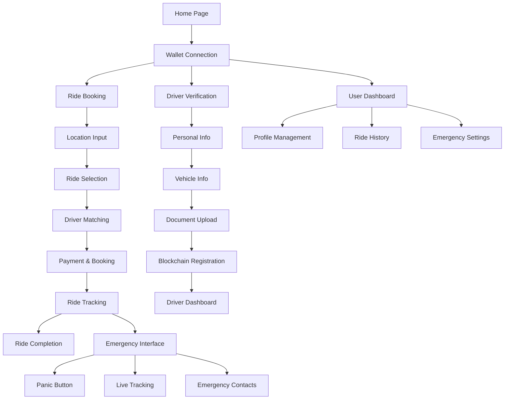

# SafeRide - Blockchain-Based Ride-Sharing Platform

## 1. Product Overview

SafeRide is a decentralized ride-sharing platform built on BlockDAG blockchain technology that prioritizes security, transparency, and user privacy through blockchain-based verification and smart contract automation.

The platform addresses trust and safety concerns in traditional ride-sharing by implementing blockchain-based driver verification, anonymized passenger profiles, and real-time emergency features. Target users include safety-conscious passengers and verified drivers seeking transparent, secure transportation services.

The platform aims to capture the growing demand for secure, decentralized transportation solutions in the $100+ billion global ride-sharing market.

## 2. Core Features

### 2.1 User Roles

| Role | Registration Method | Core Permissions |
|------|---------------------|------------------|
| Passenger | Wallet connection + profile creation | Book rides, manage anonymized profile, access emergency features |
| Driver | Multi-step blockchain verification process | Accept rides, receive payments via smart contracts, access driver dashboard |
| Admin | System-level access control | Manage verification processes, monitor platform health, handle disputes |

### 2.2 Feature Module

Our SafeRide platform consists of the following main pages:

1. **Home Page**: Hero section with platform overview, wallet connection, navigation to booking and driver registration.
2. **Ride Booking Page**: Location input, ride type selection, driver matching, payment processing via smart contracts.
3. **Driver Verification Page**: Multi-step verification process, document upload, blockchain-based credential validation.
4. **User Dashboard**: Ride history, profile management, wallet integration, emergency contacts.
5. **Driver Dashboard**: Ride requests, earnings tracking, verification status, vehicle management.
6. **Admin Panel**: Driver verification management, platform analytics, dispute resolution.
7. **Emergency Interface**: Panic button, live tracking, emergency contact notifications.

### 2.3 Page Details

| Page Name | Module Name | Feature description |
|-----------|-------------|---------------------|
| Home Page | Hero Section | Display platform benefits, blockchain security features, call-to-action buttons |
| Home Page | Wallet Integration | Connect MetaMask wallet, display connection status, switch to BlockDAG network |
| Home Page | Navigation | Access to booking, driver registration, dashboard, help sections |
| Ride Booking | Location Input | Enter pickup and destination addresses with geolocation support |
| Ride Booking | Ride Options | Select economy, premium, or express ride types with pricing |
| Ride Booking | Driver Matching | Real-time driver search, display available drivers with ratings and ETAs |
| Ride Booking | Payment Processing | Create escrow smart contract, handle blockchain transactions |
| Driver Verification | Personal Information | Collect driver details with privacy-preserving data handling |
| Driver Verification | Vehicle Information | Register vehicle details, license plate, insurance information |
| Driver Verification | Document Upload | Upload and hash driver license, insurance, vehicle registration |
| Driver Verification | Blockchain Registration | Submit verification data to smart contract, create audit trail |
| User Dashboard | Profile Management | View and edit anonymized profile data, manage privacy settings |
| User Dashboard | Ride History | Display past rides with transaction hashes, ratings, receipts |
| User Dashboard | Wallet Management | View balance, transaction history, manage payment methods |
| User Dashboard | Emergency Contacts | Configure emergency contacts, panic button settings |
| Driver Dashboard | Ride Management | Accept/decline ride requests, track active rides, complete trips |
| Driver Dashboard | Earnings Tracking | View earnings, withdrawal history, smart contract payments |
| Driver Dashboard | Verification Status | Display verification level, renewal requirements, compliance status |
| Admin Panel | Driver Verification | Review and approve driver applications, manage verification levels |
| Admin Panel | Platform Analytics | Monitor ride volume, user growth, blockchain transaction metrics |
| Admin Panel | Dispute Resolution | Handle user complaints, manage refunds, investigate incidents |
| Emergency Interface | Panic Button | Trigger emergency alerts, notify contacts and authorities |
| Emergency Interface | Live Tracking | Real-time location sharing, route monitoring, safety features |
| Emergency Interface | Emergency Contacts | Automatic notification system, escalation procedures |

## 3. Core Process

**Passenger Flow:**
1. Connect wallet and create anonymized profile
2. Enter pickup and destination locations
3. Select ride type and view available drivers
4. Confirm booking and create escrow payment
5. Track driver arrival and ride progress
6. Complete ride and release payment via smart contract
7. Rate driver and view transaction receipt

**Driver Flow:**
1. Connect wallet and begin verification process
2. Submit personal and vehicle information
3. Upload required documents for blockchain verification
4. Wait for admin approval and smart contract registration
5. Receive ride requests and accept bookings
6. Complete rides and receive automatic payments
7. Maintain verification status and compliance

**Emergency Flow:**
1. Activate panic button during ride
2. System triggers real-time location sharing
3. Automatic notifications sent to emergency contacts
4. Escalation to local authorities if needed
5. Incident logging and follow-up procedures

## 4. User Interface Design

### 4.1 Design Style

- **Primary Colors**: Deep blue (#1e40af) for trust and security, bright green (#10b981) for blockchain/success states
- **Secondary Colors**: Light gray (#f8fafc) for backgrounds, dark gray (#374151) for text
- **Button Style**: Rounded corners (8px radius), subtle shadows, hover animations with color transitions
- **Typography**: Inter font family, 16px base size, clear hierarchy with 24px/32px/48px headings
- **Layout Style**: Card-based design with clean spacing, top navigation with wallet integration
- **Icons**: Lucide React icons for consistency, blockchain-themed icons for crypto features

### 4.2 Page Design Overview

| Page Name | Module Name | UI Elements |
|-----------|-------------|-------------|
| Home Page | Hero Section | Large heading with blockchain security messaging, gradient background, animated wallet connection button |
| Home Page | Wallet Integration | MetaMask connection status badge, network indicator, balance display with BDAG token |
| Ride Booking | Location Input | Map integration, autocomplete address fields, current location button with geolocation |
| Ride Booking | Driver Matching | Driver cards with photos, ratings, vehicle info, real-time ETA updates |
| Driver Verification | Document Upload | Drag-and-drop file areas, progress indicators, blockchain hash generation feedback |
| User Dashboard | Profile Management | Anonymized data display, privacy controls, edit forms with validation |
| Emergency Interface | Panic Button | Large red emergency button, location sharing toggle, contact list with quick actions |

### 4.3 Responsiveness

The platform is mobile-first with responsive design optimizing for smartphone usage during rides. Touch interactions are optimized for emergency features, with large tap targets and gesture support for quick access to safety functions.
