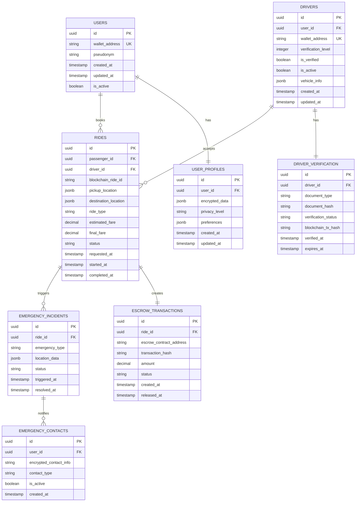

# SafeRide - Technical Architecture Document

## 1. Architecture Design


## 2. Technology Description

- **Frontend**: React@18 + TypeScript + TailwindCSS + Next.js@15
- **Backend**: Node.js@20 + Express@4 + TypeScript
- **Database**: Supabase (PostgreSQL) with Row Level Security
- **Blockchain**: BlockDAG Network + Ethers.js@6
- **Real-time**: WebSocket + Socket.io
- **Authentication**: Supabase Auth + Wallet-based authentication
- **File Storage**: Supabase Storage for encrypted documents
- **Monitoring**: Winston logging + Prometheus metrics

## 3. Route Definitions

| Route | Purpose |
|-------|---------|
| / | Home page with wallet connection and platform overview |
| /book | Ride booking interface with location input and driver matching |
| /driver/verify | Multi-step driver verification process |
| /driver/dashboard | Driver interface for managing rides and earnings |
| /dashboard | User dashboard with ride history and profile management |
| /admin | Administrative panel for verification and platform management |
| /emergency | Emergency interface with panic button and live tracking |
| /rides | Ride history and transaction details |
| /help | Support and documentation |

## 4. API Definitions

### 4.1 Driver Verification APIs

**Driver Registration**
```
POST /api/drivers/register
```

Request:
| Param Name | Param Type | isRequired | Description |
|------------|------------|------------|-------------|
| walletAddress | string | true | Driver's blockchain wallet address |
| personalInfo | object | true | Personal details (name, email, phone, address) |
| vehicleInfo | object | true | Vehicle details (make, model, year, license plate) |
| documents | array | true | Uploaded document file hashes |

Response:
| Param Name | Param Type | Description |
|------------|------------|-------------|
| driverId | string | Unique driver identifier |
| verificationStatus | string | Current verification status |
| blockchainTxHash | string | Smart contract registration transaction |

**Document Verification**
```
POST /api/drivers/verify-documents
```

Request:
| Param Name | Param Type | isRequired | Description |
|------------|------------|------------|-------------|
| driverId | string | true | Driver identifier |
| documentType | string | true | Type of document (license, insurance, registration) |
| documentHash | string | true | Blockchain hash of uploaded document |
| verificationLevel | number | true | Verification level (1-3) |

**Get Driver Status**
```
GET /api/drivers/{driverId}/status
```

Response:
| Param Name | Param Type | Description |
|------------|------------|-------------|
| verificationLevel | number | Current verification level (0-3) |
| isActive | boolean | Driver active status |
| documentsStatus | object | Status of each required document |
| blockchainVerified | boolean | Smart contract verification status |

### 4.2 Passenger Management APIs

**Create Anonymized Profile**
```
POST /api/passengers/profile
```

Request:
| Param Name | Param Type | isRequired | Description |
|------------|------------|------------|-------------|
| walletAddress | string | true | Passenger's wallet address |
| pseudonym | string | true | Generated pseudonym for privacy |
| emergencyContacts | array | false | Encrypted emergency contact information |
| preferences | object | false | Ride preferences and settings |

Response:
| Param Name | Param Type | Description |
|------------|------------|-------------|
| profileId | string | Anonymized profile identifier |
| pseudonym | string | User's pseudonym |
| privacyLevel | string | Current privacy setting |

**Update Profile**
```
PUT /api/passengers/profile/{profileId}
```

**Get Ride History**
```
GET /api/passengers/{profileId}/rides
```

Response:
| Param Name | Param Type | Description |
|------------|------------|-------------|
| rides | array | Array of anonymized ride records |
| totalRides | number | Total number of completed rides |
| totalSpent | number | Total amount spent (in BDAG tokens) |

### 4.3 Emergency APIs

**Trigger Panic Button**
```
POST /api/emergency/panic
```

Request:
| Param Name | Param Type | isRequired | Description |
|------------|------------|------------|-------------|
| rideId | string | true | Current ride identifier |
| location | object | true | Current GPS coordinates |
| emergencyType | string | true | Type of emergency (safety, medical, other) |

Response:
| Param Name | Param Type | Description |
|------------|------------|-------------|
| emergencyId | string | Emergency incident identifier |
| alertsSent | array | List of notifications sent |
| responseTime | number | Expected response time in minutes |

**Live Tracking**
```
POST /api/emergency/tracking/start
```

Request:
| Param Name | Param Type | isRequired | Description |
|------------|------------|------------|-------------|
| rideId | string | true | Ride identifier |
| shareWith | array | true | List of contacts to share location with |

**Emergency Contact Notification**
```
POST /api/emergency/notify
```

Request:
| Param Name | Param Type | isRequired | Description |
|------------|------------|------------|-------------|
| emergencyId | string | true | Emergency incident ID |
| contactIds | array | true | Emergency contacts to notify |
| message | string | true | Emergency message template |

### 4.4 Ride Booking APIs

**Create Ride Request**
```
POST /api/rides/request
```

Request:
| Param Name | Param Type | isRequired | Description |
|------------|------------|------------|-------------|
| passengerId | string | true | Passenger profile ID |
| pickup | object | true | Pickup location coordinates and address |
| destination | object | true | Destination coordinates and address |
| rideType | string | true | economy, premium, or express |
| estimatedFare | number | true | Estimated fare in BDAG tokens |

Response:
| Param Name | Param Type | Description |
|------------|------------|-------------|
| rideId | string | Unique ride identifier |
| estimatedWaitTime | number | Estimated driver arrival time |
| availableDrivers | array | List of nearby verified drivers |

**Accept Ride (Driver)**
```
POST /api/rides/{rideId}/accept
```

Request:
| Param Name | Param Type | isRequired | Description |
|------------|------------|------------|-------------|
| driverId | string | true | Driver identifier |
| estimatedArrival | number | Driver's estimated arrival time |

**Complete Ride**
```
POST /api/rides/{rideId}/complete
```

Request:
| Param Name | Param Type | isRequired | Description |
|------------|------------|------------|-------------|
| finalFare | number | true | Final fare amount |
| route | array | true | Actual route taken |
| duration | number | true | Ride duration in minutes |

## 5. Server Architecture Diagram


## 6. Data Model

### 6.1 Data Model Definition



### 6.2 Data Definition Language

**Users Table**
```sql
-- Create users table
CREATE TABLE users (
    id UUID PRIMARY KEY DEFAULT gen_random_uuid(),
    wallet_address VARCHAR(42) UNIQUE NOT NULL,
    pseudonym VARCHAR(100) NOT NULL,
    created_at TIMESTAMP WITH TIME ZONE DEFAULT NOW(),
    updated_at TIMESTAMP WITH TIME ZONE DEFAULT NOW(),
    is_active BOOLEAN DEFAULT true
);

-- Create indexes
CREATE INDEX idx_users_wallet_address ON users(wallet_address);
CREATE INDEX idx_users_created_at ON users(created_at DESC);

-- Row Level Security
ALTER TABLE users ENABLE ROW LEVEL SECURITY;

-- Grant permissions
GRANT SELECT ON users TO anon;
GRANT ALL PRIVILEGES ON users TO authenticated;
```

**Drivers Table**
```sql
-- Create drivers table
CREATE TABLE drivers (
    id UUID PRIMARY KEY DEFAULT gen_random_uuid(),
    user_id UUID REFERENCES users(id) ON DELETE CASCADE,
    wallet_address VARCHAR(42) UNIQUE NOT NULL,
    verification_level INTEGER DEFAULT 0 CHECK (verification_level >= 0 AND verification_level <= 3),
    is_verified BOOLEAN DEFAULT false,
    is_active BOOLEAN DEFAULT true,
    vehicle_info JSONB NOT NULL,
    created_at TIMESTAMP WITH TIME ZONE DEFAULT NOW(),
    updated_at TIMESTAMP WITH TIME ZONE DEFAULT NOW()
);

-- Create indexes
CREATE INDEX idx_drivers_user_id ON drivers(user_id);
CREATE INDEX idx_drivers_wallet_address ON drivers(wallet_address);
CREATE INDEX idx_drivers_verification_level ON drivers(verification_level);
CREATE INDEX idx_drivers_is_verified ON drivers(is_verified);

-- Row Level Security
ALTER TABLE drivers ENABLE ROW LEVEL SECURITY;
GRANT SELECT ON drivers TO anon;
GRANT ALL PRIVILEGES ON drivers TO authenticated;
```

**Driver Verification Table**
```sql
-- Create driver_verification table
CREATE TABLE driver_verification (
    id UUID PRIMARY KEY DEFAULT gen_random_uuid(),
    driver_id UUID REFERENCES drivers(id) ON DELETE CASCADE,
    document_type VARCHAR(50) NOT NULL,
    document_hash VARCHAR(66) NOT NULL, -- SHA-256 hash
    verification_status VARCHAR(20) DEFAULT 'pending' CHECK (verification_status IN ('pending', 'approved', 'rejected', 'expired')),
    blockchain_tx_hash VARCHAR(66),
    verified_at TIMESTAMP WITH TIME ZONE,
    expires_at TIMESTAMP WITH TIME ZONE,
    created_at TIMESTAMP WITH TIME ZONE DEFAULT NOW()
);

-- Create indexes
CREATE INDEX idx_driver_verification_driver_id ON driver_verification(driver_id);
CREATE INDEX idx_driver_verification_status ON driver_verification(verification_status);
CREATE INDEX idx_driver_verification_expires_at ON driver_verification(expires_at);

-- Row Level Security
ALTER TABLE driver_verification ENABLE ROW LEVEL SECURITY;
GRANT SELECT ON driver_verification TO anon;
GRANT ALL PRIVILEGES ON driver_verification TO authenticated;
```

**User Profiles Table (Privacy-Preserving)**
```sql
-- Create user_profiles table
CREATE TABLE user_profiles (
    id UUID PRIMARY KEY DEFAULT gen_random_uuid(),
    user_id UUID REFERENCES users(id) ON DELETE CASCADE,
    encrypted_data JSONB NOT NULL, -- Encrypted personal information
    privacy_level VARCHAR(20) DEFAULT 'standard' CHECK (privacy_level IN ('minimal', 'standard', 'enhanced')),
    preferences JSONB DEFAULT '{}',
    created_at TIMESTAMP WITH TIME ZONE DEFAULT NOW(),
    updated_at TIMESTAMP WITH TIME ZONE DEFAULT NOW()
);

-- Create indexes
CREATE INDEX idx_user_profiles_user_id ON user_profiles(user_id);
CREATE INDEX idx_user_profiles_privacy_level ON user_profiles(privacy_level);

-- Row Level Security
ALTER TABLE user_profiles ENABLE ROW LEVEL SECURITY;
GRANT ALL PRIVILEGES ON user_profiles TO authenticated;
```

**Rides Table**
```sql
-- Create rides table
CREATE TABLE rides (
    id UUID PRIMARY KEY DEFAULT gen_random_uuid(),
    passenger_id UUID REFERENCES users(id),
    driver_id UUID REFERENCES drivers(id),
    blockchain_ride_id VARCHAR(66) NOT NULL, -- Blockchain transaction ID
    pickup_location JSONB NOT NULL,
    destination_location JSONB NOT NULL,
    ride_type VARCHAR(20) NOT NULL CHECK (ride_type IN ('economy', 'premium', 'express')),
    estimated_fare DECIMAL(10,2) NOT NULL,
    final_fare DECIMAL(10,2),
    status VARCHAR(20) DEFAULT 'requested' CHECK (status IN ('requested', 'accepted', 'in_progress', 'completed', 'cancelled')),
    requested_at TIMESTAMP WITH TIME ZONE DEFAULT NOW(),
    started_at TIMESTAMP WITH TIME ZONE,
    completed_at TIMESTAMP WITH TIME ZONE
);

-- Create indexes
CREATE INDEX idx_rides_passenger_id ON rides(passenger_id);
CREATE INDEX idx_rides_driver_id ON rides(driver_id);
CREATE INDEX idx_rides_status ON rides(status);
CREATE INDEX idx_rides_requested_at ON rides(requested_at DESC);
CREATE INDEX idx_rides_blockchain_ride_id ON rides(blockchain_ride_id);

-- Row Level Security
ALTER TABLE rides ENABLE ROW LEVEL SECURITY;
GRANT SELECT ON rides TO anon;
GRANT ALL PRIVILEGES ON rides TO authenticated;
```

**Emergency Incidents Table**
```sql
-- Create emergency_incidents table
CREATE TABLE emergency_incidents (
    id UUID PRIMARY KEY DEFAULT gen_random_uuid(),
    ride_id UUID REFERENCES rides(id),
    emergency_type VARCHAR(20) NOT NULL CHECK (emergency_type IN ('safety', 'medical', 'vehicle', 'other')),
    location_data JSONB NOT NULL,
    status VARCHAR(20) DEFAULT 'active' CHECK (status IN ('active', 'resolved', 'escalated')),
    triggered_at TIMESTAMP WITH TIME ZONE DEFAULT NOW(),
    resolved_at TIMESTAMP WITH TIME ZONE
);

-- Create indexes
CREATE INDEX idx_emergency_incidents_ride_id ON emergency_incidents(ride_id);
CREATE INDEX idx_emergency_incidents_status ON emergency_incidents(status);
CREATE INDEX idx_emergency_incidents_triggered_at ON emergency_incidents(triggered_at DESC);

-- Row Level Security
ALTER TABLE emergency_incidents ENABLE ROW LEVEL SECURITY;
GRANT ALL PRIVILEGES ON emergency_incidents TO authenticated;
```

**Emergency Contacts Table**
```sql
-- Create emergency_contacts table
CREATE TABLE emergency_contacts (
    id UUID PRIMARY KEY DEFAULT gen_random_uuid(),
    user_id UUID REFERENCES users(id) ON DELETE CASCADE,
    encrypted_contact_info JSONB NOT NULL, -- Encrypted contact details
    contact_type VARCHAR(20) NOT NULL CHECK (contact_type IN ('family', 'friend', 'medical', 'legal')),
    is_active BOOLEAN DEFAULT true,
    created_at TIMESTAMP WITH TIME ZONE DEFAULT NOW()
);

-- Create indexes
CREATE INDEX idx_emergency_contacts_user_id ON emergency_contacts(user_id);
CREATE INDEX idx_emergency_contacts_is_active ON emergency_contacts(is_active);

-- Row Level Security
ALTER TABLE emergency_contacts ENABLE ROW LEVEL SECURITY;
GRANT ALL PRIVILEGES ON emergency_contacts TO authenticated;
```

**Escrow Transactions Table**
```sql
-- Create escrow_transactions table
CREATE TABLE escrow_transactions (
    id UUID PRIMARY KEY DEFAULT gen_random_uuid(),
    ride_id UUID REFERENCES rides(id),
    escrow_contract_address VARCHAR(42) NOT NULL,
    transaction_hash VARCHAR(66) NOT NULL,
    amount DECIMAL(18,8) NOT NULL, -- Support for BDAG token precision
    status VARCHAR(20) DEFAULT 'created' CHECK (status IN ('created', 'funded', 'released', 'refunded')),
    created_at TIMESTAMP WITH TIME ZONE DEFAULT NOW(),
    released_at TIMESTAMP WITH TIME ZONE
);

-- Create indexes
CREATE INDEX idx_escrow_transactions_ride_id ON escrow_transactions(ride_id);
CREATE INDEX idx_escrow_transactions_status ON escrow_transactions(status);
CREATE INDEX idx_escrow_transactions_transaction_hash ON escrow_transactions(transaction_hash);

-- Row Level Security
ALTER TABLE escrow_transactions ENABLE ROW LEVEL SECURITY;
GRANT SELECT ON escrow_transactions TO anon;
GRANT ALL PRIVILEGES ON escrow_transactions TO authenticated;
```

**Initial Data**
```sql
-- Insert sample verification levels
INSERT INTO driver_verification (driver_id, document_type, document_hash, verification_status, blockchain_tx_hash)
VALUES 
('00000000-0000-0000-0000-000000000001', 'drivers_license', '0x1234567890abcdef...', 'approved', '0xabcdef1234567890...'),
('00000000-0000-0000-0000-000000000001', 'insurance', '0x2345678901bcdef0...', 'approved', '0xbcdef01234567890...'),
('00000000-0000-0000-0000-000000000001', 'vehicle_registration', '0x3456789012cdef01...', 'approved', '0xcdef012345678901...');

-- Insert sample ride types configuration
CREATE TABLE ride_type_config (
    ride_type VARCHAR(20) PRIMARY KEY,
    base_fare DECIMAL(10,2) NOT NULL,
    per_km_rate DECIMAL(10,2) NOT NULL,
    per_minute_rate DECIMAL(10,2) NOT NULL,
    surge_multiplier DECIMAL(3,2) DEFAULT 1.0
);

INSERT INTO ride_type_config (ride_type, base_fare, per_km_rate, per_minute_rate)
VALUES 
('economy', 2.50, 1.20, 0.25),
('premium', 4.00, 1.80, 0.35),
('express', 3.50, 1.50, 0.40);
```
